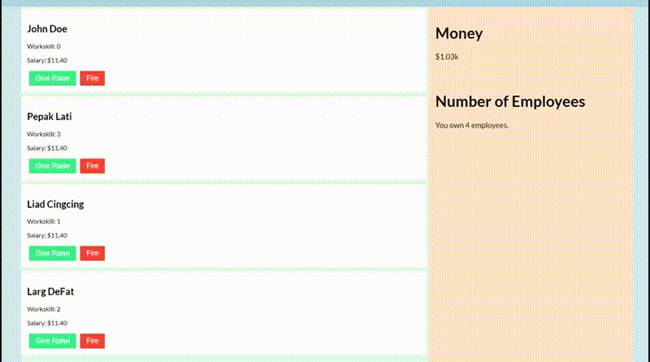

This is a ReactJS project that was Bootstrapped using Create React App.
This project was created as a project to enhance and experience the ins and outs of using ReactJS.

The EmployeeSimulator application is an application to manage and keep track of employees, giving the ability to fire them or give them a raise. 

The following gif is a demonstration of components being dynamically tracked, showing the total number of employees decreasing after an employee was fired.

